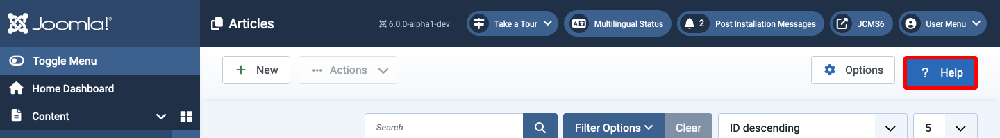

<!-- Filename: Help5.x:Start_Here / Display title: Start Here -->

## Help with Joomla! 5

For help with a specific administrator page, within the Joomla
administrator interface you can select the **Help** toolbar button for
further information about the page. It is located at the right of the
Toolbar just beneath the Title bar. Example:

A modal dialog will pop up in the middle of the screen containing Help
information specific to that page.

## Help Screen Version Notice

These Help Screens are for Joomla! Version 5. Sometimes Joomla updates
cause a Help screen to differ from the page it is supporting. There may
be new or removed options or differences in functionality. Otherwise,
all help screens will still function as expected. Remember, you should
always **update your Joomla! version** as soon as possible to benefit
from new features and/or security enhancements.

## Getting started

If you have only recently started working with Joomla you will probably
have experienced the pain of learning a new system. New terminology, new
ways of doing things, perhaps even the web itself may be new to you.
Then let this guide relieve some of that pain.

- [Getting Started with Joomla! 5](https://docs.joomla.org/Special:MyLanguage/J5.x:Getting_Started_with_Joomla!/en)
- [Getting Started: Site and Administrator templates](https://docs.joomla.org/Special:MyLanguage/J5.x:Getting_Started:_Site_and_Administrator_templates/en)
- [Getting Started: Adding an Article](https://docs.joomla.org/Special:MyLanguage/J5.x:Getting_Started:_Adding_an_Article/en)
- [Getting Started: Adding a Menu Item](https://docs.joomla.org/Special:MyLanguage/J5.x:Getting_Started:_Adding_a_Menu_Item/en")
- [Getting Started: Adding a Category](https://docs.joomla.org/Special:MyLanguage/J5.x:Getting_Started:_Adding_a_Category/en)
- [Getting Started: Adding a Module](https://docs.joomla.org/Special:MyLanguage/J5.x:Getting_Started:_Adding_a_Module/en)

## Keeping your website secure

- [Joomla! Security Checklist](https://docs.joomla.org/Security_Checklist/en)

## Further information by reader profile

- [Administrators](https://docs.joomla.org/Special:MyLanguage/Portal:Administrators/en)
- [Web Designers](https://docs.joomla.org/Special:MyLanguage/Web_designers/en)
- [Developers](https://docs.joomla.org/Special:MyLanguage/Portal:Developers/en)
- [Evaluators](https://docs.joomla.org/Special:MyLanguage/Evaluators/en)
- [more user profiles...](https://docs.joomla.org/Special:MyLanguage/Start_here/en)

Source of this article: https://docs.joomla.org/Help5.x:Start_Here
