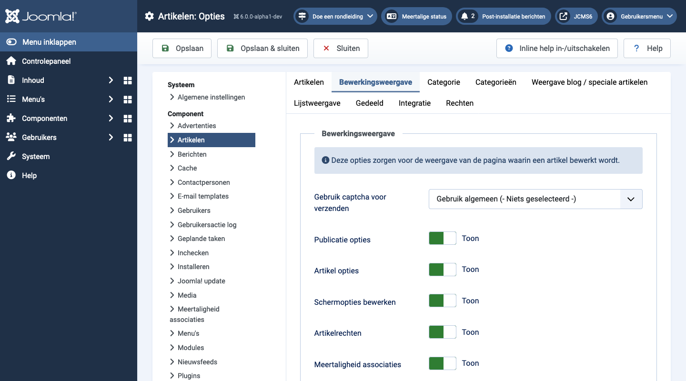
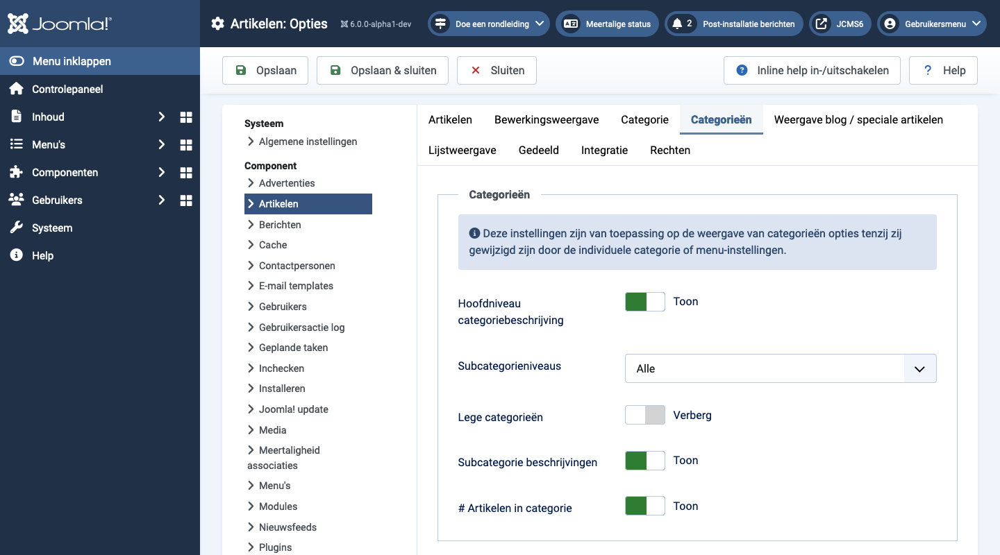
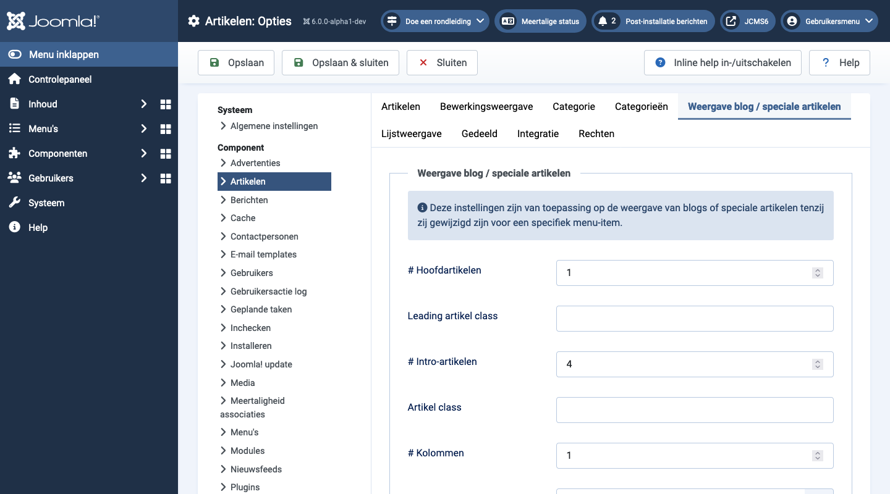
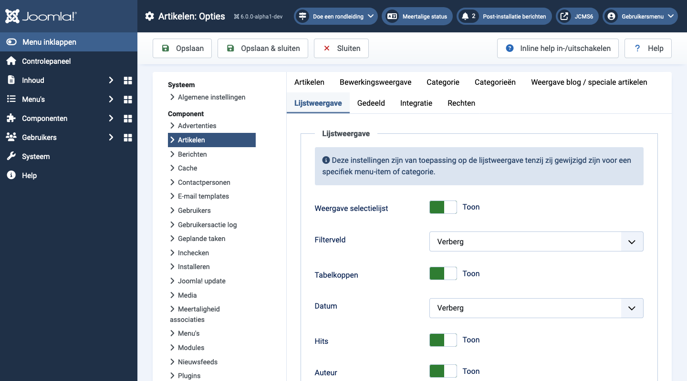
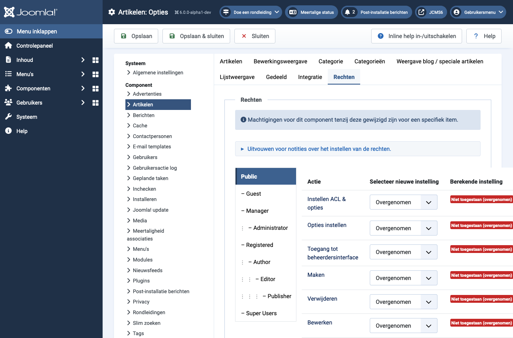

<!-- Filename: Help4.x:Articles:_Options / Display title: Artikelen: Opties -->

## Beschrijving

Wordt gebruikt om de algemene standaards voor [menu-items die artikelen
tonen in te stellen](#menus). Deze standaard waarden worden gebruikt als
'Gebruik algemeen' wordt geselecteerd als optie in een artikel
menu-item.

Om bijvoorbeeld de 'Aanmaak datum' te tonen bij een artikel in uw
artikel menu-items, zet die optie dan hier op 'Toon' en het wordt de
standaard waarde.

U hoeft geen van deze opties in te stellen. Uw Joomla site zal met de
standaard instellingen werken.

## Hoe toegang te krijgen
Selecteer **Inhoud → Artikelen**

- Klik de **Opties** werkbalk knop.

## Schermafbeelding

## Formulier velden

### Artikel

Opties gebruikt in artikelen en de menu-items Blog, Lijst, Speciale Artikelen,
Lijst met alle Categorieën en

#### Weergave

- **Kies een weergave**. Selecteer de standaard waarde Enkel artikel
  menu-items.
- **Titel**. Toon de titel van het artikel.
- **Gelinkte titels**. Of de titel van het artikel wel of niet een link
  moet zijn naar een Individueel Artikel menu-item voor het artikel.
- **Introtekst**.
  - Toon: De Introtekst van het artikel wordt getoond als men naar het
    artikel gaat.
  - Verberg: Alleen het deel van het artikel na de 'Lees meer' wordt
    getoond.
- **Positie van artikelinformatie**.
  - Boven: Plaatst het artikel-informatieblok boven de tekst.
  - Onder: Plaatst het artikel-informatieblok boven de tekst.
  - Verdelen: Splitst het artikel-informatieblok in 2 aparte blokken.
    Eén boven en de ander onder de tekst.
- **Titel artikelinformatie**. Toont 'Details' boven het
  artikelinformatie gedeelte.

#### Categorie

- **Categorie**. Toont de categorietitel van een artikel.
  - **Link categorie**. Toont de titel als link naar die categorie.Let
    op: Dit kan ingesteld worden op óf een Blog óf een lijst weergave
    met de Kies een
    weergave
    optie op het categorie tabblad.
- **Hoofdcategorie**. Toont de titel van de hoofdcategorie van een
  artikel.
  - **Link bovenliggende categorie**. Toont de titel als link naar die
    categorie.Let op: Dit kan ingesteld worden op óf een Blog óf een
    lijst weergave met de Kies een
    weergave
    optie op het categorie tabblad.

#### Associaties

- **Associaties**. Toont de geassocieerde vlaggen of taalcodes. Alleen
  meertaligheid.
  - **Gebruik afbeeldingen van vlaggen**. Toon taalkeuze als
    afbeeldingsvlag.

#### Auteur

- **Auteur**. Toont de auteur van een artikel.
  - **Link naar de contactpagina van de auteur**. Toont het als link
    naar een contactpersonen weergave van die auteur.Let op: De auteur
    moet als contactpersoon
    ingesteld
    zijn. Een link zal ook niet zichtbaar zijn als er een Auteur
    alias
    waarde voor het artikel is.

#### Datum

- **Aanmaakdatum**. Toont de aanmaakdatum van een artikel.
- **Aanpassingsdatum**. Toont de aanpassingsdatum van een artikel.
- **Publicatiedatum**. Toont de publicatiedatum van een artikel.

#### Opties

- **Navigatie**. Toont een navigatie link 'vorige' of 'volgende' indien
  door artikelen gebladerd wordt.
- **"Lees meer" link**. Toont de "Lees Meer..." link om het deel van het
  artikel voor het "Lees Meer..." breekpunt te splitsen van de rest van
  het Artikel.
- **Titel in Lees meer**.
  - Toon: De artikel titel is deel van de 'Lees meer' link. De link zal
    zijn in het formaat "Lees meer: \[article title\]".
  - Verberg: De link zal zijn "Lees meer".
- **Lees meer limiet (tekens)**. Het maximale aantal tekens van de titel
  dat wordt gebruikt.Let op: Dit kan voorkomen dat de 'Lees meer' tekst
  enorm lang wordt als het artikel een erg lange titel heeft.
- **Tags**. Toon de tags voor elk artikel.
- **Hits bijhouden**. Sla het aantal keer dat het artikel bekeken is op.
- **Hits**. Toon het aantal keren dat een artikel getoond is aan
  gebruikers.
- **Niet-toegestane links**.
  - Ja: De Introtekst voor beperkte artikelen wordt getoond. Klikken op
    de 'Lees meer' link heeft tot gevolg dat gebruikers in moeten loggen
    om de inhoud van het artikel te zien.
  - Nee: Artikelen die de gebruiker niet mag zien (gebaseerd op de
    weergave rechten van het artikel) worden niet getoond.
- **Positionering van de links**.
  - Boven: Links worden boven de inhoud getoond.
  - Onder: Links worden onder de inhoud getoond.

### Bewerkingsweergave

Optie van de artikel bewerk pagina.

- **Gebruik captcha voor verzenden**. Selecteer de captcha plugin
  die gebruikt zal worden voor het artikel verzendformulier. Zorg dat er
  een captcha plugin is geselecteerd bij de Algemene
  instellingen
  wanneer 'Gebruik algemeen' is geselecteerd.
- **Publicatie opties**. Verberg het Publicatie opties
  tabblad
  in het beheergedeelte tijden het bewerken van artikelen. Dit betekent
  dat gebruikers aan de beheerkant niet in staat zijn de velden in dit
  tabblad te bewerken . Deze velden worden altijd op hun standaard
  waarde gezet.
- **Artikel opties**. Verberg het Artikel opties
  tabblad
  in in het beheerdeel tijdens het bewerken van artikelen. Dit betekent
  dat gebruikers in het beheergedeelte niet in staat zijn de velden op
  dit tabblad te bewerken. Deze velden worden altijd op hun standaard
  waarde gezet.
- **Schermopties bewerken**. Verberg het Instellingen bewerkscherm
  tabblad
  bij het bewerken van artikelen.
- **Artikelrechten**. Verberg het Rechten
  tabblad
  bij het bewerken van artikelen.
- **Meertaligheid associaties**. Verberg het Associaties
  tabblad
  bij het bewerken van artikelen.
- **Versies inschakelen**. Sla versie historie voor artikelen en
  categorieën op.
- **Maximum aantal versies**. Het maximum aantal versies dat opgeslagen
  wordt voor een artikel of categorie. Als een artikel of categorie
  opgeslagen wordt en het maximum aantal bereikt bereikt is, zal de
  oudste versie automatisch verwijderd worden. Indien op "0", zullen
  versies nooit automatisch verwijderd worden. Meer
  leren.
- **Afbeeldingen en links - website**. Verberg de afbeeldingen en links
  op het bewerkscherm van het artikel op de website.
- **Afbeeldingen en links - beheergedeelte**. Verberg het [Afbeeldingen
  en links
  tabblad](https://docs.joomla.org/Help4.x:Articles:_Edit/nl#imagesandlinks "Help4.x:Articles: Edit/nl")
  in het beheerdeel bij het bewerken van artikelen.
- **URL A doelvenster**. Stelt de standaard waarde in voor het
  doelvenster van de eerste link in het artikel. Keuzes zijn:
  - Openen in het hoofdvenster: Opent de link in het hoofdvenster en
    vervangt het huidige Joomla artikel.
  - Openen in een nieuw venster: Opent de link in een nieuw
    browservenster.
  - Openen in pop-upvenster: Opent de link in een pop-up venster (zonder
    volledige navigatie-elementen).
  - Modaal: Opent de link in een modaal pop-up venster.
- **URL B doelvenster**. Stelt de standaard waarde in voor het
  doelvenster van de tweede link in het artikel. Zelfde opties al URL A.
- **URL C doelvenster**. Stelt de standaard waarde in voor het
  doelvenster van de derde link in het artikel. Zelfde opties als URL A.
- **Introductie afbeelding class**. Zorgt voor de class van de
  introductie afbeelding die gekozen wordt als afbeeldingsveld.
- **Volledige afbeelding class**. Zorgt voor de class van de afbeelding
  van een volledig artikel die geselecteerd wordt in het volledige
  artikel afbeeldingsveld.

### Categorie

Opties die bepalen hoe een categorie en zijn artikelen getoond worden.
Ze worden gebruikt bij categorieën en de menu-items Blog, Lijst en

- **Kies een weergave**. Selecteer de standaard weergave selecteren die
  getoond wordt als u op een categorie link klikt.
- **Categorietitel**. Toon de titel van de categorie.
- **Beschrijving van categorie**. Toon de beschrijving van de categorie.
- **Afbeelding van categorie**. Toon de afbeelding van de categorie.
- **Subcategorieniveaus**. Bepaalt hoeveel niveaus van subcategorieën
  getoond worden.
- **Lege categorieën**. Toon de categorieën die geen artikelen of
  subcategorieën bevatten.
- **Bericht geen artikelen**. Toont een bericht "Er zijn geen artikelen
  in deze categorie".
- **Subcategorieën koptekst**. Toon de subcategorie als subkop op de
  pagina.
- **Subcategorie beschrijvingen**. Toon de beschrijving van
  subcategorieën die getoond worden.
- **\# Artikelen in categorie**. Toon het aantal artikelen in iedere
  categorie.
- **Tags**. Tonen van de tags voor elke categorie.

### Categorieën

Opties bepalen de weergave van het menu-item

- **Hoofdniveau categoriebeschrijving**. Toon de beschrijving van de
  hoofdcategorie.
- **Subcategorieniveaus**. Het aantal weer te geven subcategorieniveaus.
- **Lege categorieën**. Toon de categorieën die geen artikelen of
  subcategorieën bevatten.
- **Subcategorie beschrijvingen**. Toon de beschrijving van elke
  subcategorie.
- **\# Artikelen in categorie**. Toon het aantal artikelen in iedere
  categorie.

### Weergave blog / speciale artikelen

Deze opties bepalen de weergave van de menu-items Blog, Speciale artikelen en

- **\# Hoofdartikelen**. Aantal Artikelen te tonen met behulp van de
  volledige breedte van de blog pagina. "0" betekent dat er geen
  Artikelen worden weergegeven in de volledige breedte. Wanneer u een
  Artikel heeft met een "Lees meer..." breekpunt, wordt alleen het deel
  van de tekst voor het breekpunt (de Intro-tekst) weergegeven.
- **Leading artikel class**. Elke CSS class kan toegevoegd worden voor
  eigen styling ideeën. Voeg een rand toe boven met de class
  boxed.Gebruik voor afbeelding positie bijvoorbeeld image-left,
  image-right. Voeg image-alternate toe voor een wisselende volgorde van
  intro-afbeeldingen.
- **\# Intro-artikelen**. Bepaalt het aantal Artikelen dat wordt
  weergeven na het Hoofdartikel. Deze Artikelen worden weergegeven in
  het aantal kolommen in de Kolommen parameter hieronder. Wanneer u een
  Artikel heeft met een "Lees meer..." breekpunt, wordt alleen de tekst
  voor het breekpunt (Intro tekst) weergegeven, gevolgd door een "Lees
  meer..." link. De volgorde voor het weergeven van de artikelen wordt
  bepaald door de Categorie Volgorde en Artikel Volgorde parameters
  hieronder.
- **Artikel class**. Elke CSS class kan toegevoegd worden voor eigen
  styling ideeën. Voeg een rand toe boven met de class boxed.Gebruik
  voor afbeelding positie bijvoorbeeld image-left, image-right. Voeg
  image-alternate toe voor een wisselende volgorde van
  intro-afbeeldingen.
- **\# Kolommen**. Het aantal kolommen dat gebruikt moet worden in het
  Intro tekstvak. Dit ligt normaliter tussen 1 en 3 (afhankelijk van het
  template dat u gebruikt). Als 1 gebruikt wordt, wordt het intro tekst
  artikel getoond in de volledige breedte van de ruimte, net als het
  eerste artikel. Laat leeg om de standaard waarde uit de component
  opties te gebruiken.
- **Meervoudige kolomrichting**. In de multi-kolom blog layouts, of
  artikelen qua volgorde getoond moeten worden van boven naar beneden
  binnen de kolommen of van links naar rechts over de kolommen.
  - Naar beneden: Om de artikelen qua volgorde eerst te tonen in de
    eerste kolom totdat deze vol is, en vervolgens in de volgende kolom,
    bijvoorbeeld:

-
  - Links naar rechts: Om de artikelen van links naar rechts te tonen
    over de kolommen heen tot de laatste kolom is bereikt, en vervolgens
    weer terug naar de eerste kolom, bijvoorbeeld:

-
- **\# Links**. Het aantal artikelen waarvan alleen de titel als link
  getoond moet worden in het 'Links' gedeelte van de pagina. Deze links
  staan een Gebruiker toe om te navigeren naar aanvullende Artikelen als
  er meer Artikelen zijn dan op de eerste pagina van de Blog Lay-out
  passen.
- **Inclusief subcategorieën**.
  - Geen: Alleen artikelen uit de huidige categorie worden getoond.
  - Alle: Alle artikelen uit de huidige categorie en alle onderliggende
    categorieën worden getoond.
  - 1-5: Alle artikelen uit de huidige categorie en onderliggende
    categorieën t/m dit niveau worden getoond.
- **Gekoppelde intro-afbeelding**. Indien 'Ja', dan toont een klik op de
  intro-afbeelding het artikel.

### Lijstweergave

Deze opties bepalen de weergave van de menu-items List en

- **Weergave selectielijst**. Of het Toon \# control getoond of
  verborgen moet worden, welke de gebruiker de mogelijkheid geeft het
  aantal items te selecteren dat getoond wordt in de lijst.
- **Filterveld**. Toont een tekstveld op de website waar een gebruiker
  de artikelen kan filteren.Opties in het beheergedeelte menu-item
  bewerken.
  - Verberg: Toon geen filterveld.
  - Titel: Filter op artikeltitel.
  - Auteur: Filter op de naam van de auteur.
  - Hits: Filter op het aantal hits van artikelen.
  - Tags: Filter op de artikel tags.
  - Maand (gepubliceerd): Filter op maand van gepubliceerde artikelen.
- **Tabelkoppen**. Toont een kop boven de lijst met artikelen op de
  website.
- **Datum**. Toon een datum in de lijst.
  - Verberg: Geen datum tonen.
  - Aangemaakt: Toon de aanmaakdatum.
  - Aangepast: Toon de datum van de laatste wijziging.
  - Gepubliceerd: Toon de datum van publiceren.
- **Hits**. Toon het aantal hits van artikelen.
- **Auteur**. Toon de naam van de auteur.
- **\# Artikelen in lijst**. Aantal artikelen in de lijst.

### Gedeeld

Opties gedeeld door de menu-items Blog, Lijst en

- **Volgorde categorieën**.
  - Geen volgorde: Artikelen worden alleen gesorteerd op
    artikelvolgorde, onafhankelijk van de categorie.
  - Titel alfabetisch: Categorieën worden getoond op de titel in
    alfabetische volgorde (A tot Z).
  - Titel alfabetisch omgekeerd: Categorieën worden getoond op de titel
    in omgekeerd alfabetische volgorde (Z tot A).
  - Volgorde categorieën: Categorieën zijn gesorteerd volgens de
    volgorde kolom ingegeven in
- **Volgorde artikelen**.
  - Meest recente eerst: Artikelen worden getoond die beginnen met de
    meest recente en eindigend met de oudste.
  - Oudste eerst: Artikelen worden getoond met de oudste als eerste en
    eindigen met de nieuwste.
  - Titel alfabetisch: Artikelen worden getoond op de titel in
    alfabetische volgorde (A tot Z).
  - Titel alfabetisch omgekeerd: Artikelen worden getoond op de titel in
    omgekeerde alphabetische volgorde (Z tot A).
  - Auteur alfabetisch: Artikelen worden getoond op auteur in
    alphabetische volgorde (A tot Z).
  - Auteur omgekeerd alfabetisch: Artikelen worden getoond op auteur in
    omgekeerd alfabetische volgorde (Z tot A).
  - Meeste hits: Artikelen worden getoond op het aantal weergaven door
    het aantal hits, te beginnen met de meeste hits en eindigen met de
    minste hits.
  - Minste hits: Artikelen worden getoond door het aantal hits, te
    beginnen met de minste hits en eindigend met de meeste hits.
  - Volgorde: Artikelen zijn gesorteerd volgens de volgorde kolom zoals
    opgegeven in
  - Omgekeerde volgorde: Artikelen worden omgekeerd gesorteerd aan de
    kolomvolgorde opgegeven bij
    Artikelbeheer.
- **Datum voor sortering**. De datum die gebruikt wordt als artikelen op
  datum worden gesorteerd.
  - Aangemaakt: Gebruik de aanmaakdatum van het artikel.
  - Aangepast: Gebruik de wijzigingsdatum van het artikel.
  - Gepubliceerd: Gebruik de publicatiedatum van het artikel.
- **Paginering**. Paginering geeft paginalinks weer onderaan de pagina
  waarmee gebruikers naar andere pagina's kunnen navigeren. Deze zijn
  nodig wanneer de items in de lijst niet op een pagina passen.
  - Verberg: Paginalinks niet tonen. Let op: Gebruikers kunnen niet naar
    andere pagina's navigeren.
  - Toon: Paginalinks tonen indien nodig.
  - Automatisch: Paginalinks tonen indien nodig.
- **Paginering samenvatting**. Toon het huidige paginanummer en totaal
  aantal pagina's (bijvoorbeeld, "Pagina 1 van 2") onderaan iedere
  pagina.
- **Speciale artikelen**.
  - Toon: Toon Speciale artikelen en Niet-speciale artikelen.
  - Verberg: Toon alleen Niet-speciale artikelen.
  - Alleen: Toon alleen Speciale artikelen.

### Integratie

Opties bepalen hoe artikelen integreren met Nieuwsfeeds, Routering,
Extra velden, en Workflow.

#### Nieuwsfeeds

- **RSS feed link**. Als deze ingesteld staat op Toon zal de Feedlink
  verschijnen als een feedicoon in de adresbalk bij de meeste browsers.
- **Toon in feed**.
  - Introtekst: Alleen de introtekst van het artikel wordt getoond in de
    feed.
  - Volledige tekst: De volledige tekst van het artikel wordt getoond in
    de feed.
- **"Lees meer" link**. Toon of verberg een "Lees meer" link in de feed.

#### Routering

- **Verwijder ID's uit URL's**. Verwijder de database-ID van artikelen
  in een link.

#### Extra velden

- **Extra velden inschakelen**. Extra velden aanmaken inschakelen. Meer
  leren.

#### Workflow

- **Workflow**. Gebruik aangepaste workflows om artikelen te beheren.
  Meer
  leren.

### Rechten

Deze sectie laat u de stndaard ACL rechten instellen voor alle artikelen 
in alle categorieën.

Om de rechten van artikelen en categorieën te wijzigen moet het volgende
gedaan worden.

1.  Selecteer de **Groep** door op de titel aan de linkerzijde te
    klikken.
2.  Zoek de gewenste **Actie**.
    - **Instellen ACL & opties**. Gebruikers kunnen de opties en rechten
      bewerken.
    - **Alleen instellingenopties**. Gebruikers kunnen de opties
      bewerken, behalve de rechten.
    - **Toegang tot beheerdersinterface**. Gebruikers hebben toegang tot
      de beheerdersinterface.
    - **Maken**. Gebruikers mogen artikelen en categorieën aanmaken.
    - **Verwijderen**. Gebruikers mogen artikelen en categorieën
      verwijderen.
    - **Bewerken**. Gebruikers mogen artikelen en categorieën bewerken.
    - **Bewerk status**. Gebruikers kunnen de status en verwante
      informatie bewerken.
    - **Bewerk eigen**. Gebruikers mogen de zelf aangemaakte artikelen
      en categorieën bewerken.
    - **Bewerk waarde extra veld**. Gebruikers kunnen iedere waarde van
      eigen velden bewerken die in artikelen en categorieën staan.
    - **Workflows beheren**. Gebruikers kunnen workflows beheren.
    - **Overgang uitvoeren**. Gebruikers kunnen overgangen uitvoeren.
3.  Selecteer de gewenste rechten voor de actie die u wilt wijzigen.
    - **Overgenomen**. Overgenomen van gebruikers in deze groep vanuit
      de Algemene
      instellingen
      rechten.
    - **Toegestaan**. Toegestaan voor gebruikers in deze groep.Let op:
      Als deze actie 'Geweigerd' is op een van de hogere niveaus, dan
      heeft de 'Toegestaan' rechten hier geen effect. Een 'Geweigerd'
      instelling kan niet overschreven worden.
    - **Geweigerd**. Geweigerd voor gebruikers in deze groep.
4.  Klik op **Opslaan** in de **werkbalk** bovenin. Wanneer het scherm
    herladen wordt zal de nieuwe gecalculeerde rechten voor deze groep
    en actie weergegeven worden.

## Werkbalk

Bovenaan de pagina ziet u de werkbalk zoals in de
afbeelding hierboven.

- **Opslaan**. Slaat de artikelen opties op en blijft op het huidige
  scherm.
- **Opslaan & sluiten**. Slaat de artikelen opties op en sluit het
  huidige scherm.
- **Sluiten**. Sluit het huidige scherm en keert terug naar het vorige
  scherm zonder wijzigingen die u misschien heeft gedaan op te slaan.
- **Inline help in-/uitschakelen**. Show help text below some options.
- **Help**. Opent dit helpscherm.

## Snelle tips

- Als u een beginnend gebruiker bent, dan kunt u de de standaard waarden
  aanhouden totdat u meer heeft geleerd over het gebruik van de algemene
  opties.
- Als u een gevorderde gebruiker bent, kunt u tijd besparen door hier
  goede standaard waarden in te stellen. Als u menu-items maakt en
  artikelen aanmaakt, dan kunt u de standaard waarden voor de meeste
  opties aanvaarden.
- Alle waarden die hier ingesteld worden kunnen overschreven worden op
  het menu-item, categorie of contactpersoon niveau.
